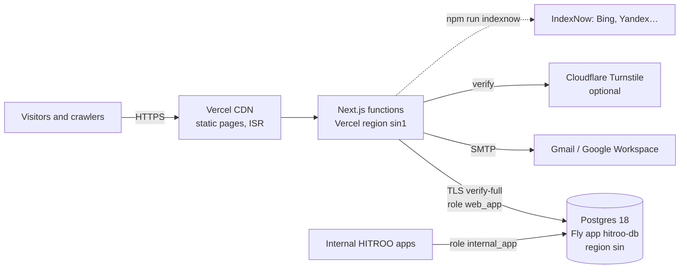

# HITROO — Architecture

How the HITROO website and the shared HITROO database fit together. Pairs with [KT.md](KT.md) (what we built), [CHANGELOG.md](CHANGELOG.md) (what changed, when) and [designs.md](designs.md) (how it looks).

## System overview



| Piece | Where | Notes |
| --- | --- | --- |
| Website | Vercel (Next.js 13 App Router) | `vercel.json` pins functions to `sin1` (Singapore), next to the database. Static pages come from Vercel's global CDN. |
| Database | Fly.io app `hitroo-db` | Fly Postgres (flex), PostgreSQL 18, 1 machine `shared-cpu-1x` / 1 GB, 10 GB encrypted volume, region `sin`. |
| Public DB endpoint | `hitroo-db.fly.dev:5432` | Dedicated IPv4 `149.248.221.16` ($2/month) with Fly's `pg_tls` handler; connect with `sslmode=verify-full`. Fly apps can use `hitroo-db.internal` over the private network. |
| Email | Gmail SMTP (`nodemailer`) | Lead and application notifications plus acknowledgments. |
| Spam protection | Honeypot + timing + optional Turnstile | Turnstile only when both keys are set. |

The Fly app replaced the earlier `decern-hitroo` server, which was destroyed on 2026-09-25 (its 892 KB data volume is backed up at `Hitroo_internal_Apps/_backups/decern-data-backup-2026-09-25.tgz`).

## Database layout

One database, `hitroo`, split into segments by schema. Each consumer gets its own login role.

| Schema | Owner | Used by | Access |
| --- | --- | --- | --- |
| `web` | `postgres` | This website | `web_app`: SELECT/INSERT/UPDATE/DELETE on rows only (no DDL). Migrations run as `postgres`. |
| `internal` | `internal_app` | Internal HITROO apps | `internal_app` owns the schema and manages its own tables. |
| `public` | — | `public.schema_migrations` only | `PUBLIC` has no access. |

`web` tables (see [db/migrations/001_web_init.sql](db/migrations/001_web_init.sql)):

| Table | Holds |
| --- | --- |
| `web.leads` | Project enquiries (name, email, phone, interest, message, page, country/region/city, user agent, `emailed`, `status`). |
| `web.job_applications` | Careers applications, including the PDF resume (`bytea`, ≤ 5 MB) and `status`. |
| `web.page_views` | First-party analytics: path, referrer host, UTM, country/region/city, device/browser/OS, language; `visitor_id`/`session_id` only with consent. No IP addresses. |
| `web.consents` | Cookie decisions (`granted`/`denied`, policy version, country) as proof of consent. |
| `web.posts` | Articles and blog posts (kind, slug, title, excerpt, body, category, cover, status, dates, SEO fields, `legacy_id`). |

**Credentials** live outside the repo in `Hitroo_internal_Apps/_secrets/hitroo-db.env` (chmod 600): superuser URL, `hitroo` admin URL, `web_app` URL and `internal_app` URL. The website only ever gets `DATABASE_URL` (the `web_app` URL). Store these in a password manager too.

### Adding another internal app

```sql
-- as postgres, on database hitroo
CREATE ROLE app_example LOGIN PASSWORD '…' CONNECTION LIMIT 20;
GRANT CONNECT ON DATABASE hitroo TO app_example;
CREATE SCHEMA app_example AUTHORIZATION app_example;
```

Then give the app `postgres://app_example:…@hitroo-db.fly.dev:5432/hitroo?sslmode=verify-full` (or `hitroo-db.internal:5432` if it runs on Fly) and set its `search_path` to its schema. Keep apps in separate schemas and roles; share data through explicit views, not shared tables.

## Data flows

1. **Enquiries** — home page and `/contact` → `POST /api/lead` → strict zod schema, same-origin check, honeypot, completion timing, optional Turnstile → `INSERT web.leads` → Gmail notification + acknowledgment → `emailed = true`. If email fails, the lead is already stored and the visitor still sees success.
2. **Careers** — `/careers` → `POST /api/careers` → validation and PDF check → `INSERT web.job_applications` (with the resume) → email with the resume attached.
3. **Analytics** — `components/corporate/Analytics` runs on every route change → `POST /api/track` → bot filter, 120 requests/min/IP, same-origin → `INSERT web.page_views`. Country, region and city come from Vercel's edge headers (`x-vercel-ip-*`); the IP itself is never stored. Visitor and session IDs are attached only when the `hitroo_consent` cookie is `granted`.
4. **Consent** — `CookieConsent` (bottom-left) sets `hitroo_consent` (1 year) and, on accept, `hitroo_vid` (random UUID, 1 year) → `POST /api/consent` → `INSERT web.consents`. "Cookie settings" in the footer reopens it. Policy text: `/privacy`.
5. **Insights (articles and blog)** — `/admin` → `/api/admin/posts` (create, update, delete) → `web.posts` → `revalidatePath` refreshes `/insights`, `/articles`, `/blog` and the post page at once (ISR every 5 minutes otherwise). The sitemap and `llms.txt` refresh every 10 minutes.
6. **Admin** — `/admin` (not indexed) → `/api/admin/*` with the `x-admin-password` header (constant-time compare; 10 failed attempts per 15 minutes per IP) → insights, leads, applications (resume download) and posts.

## SEO and GEO (answer engines)

- **Metadata per page** via `pageMetadata()` in [lib/seo.ts](lib/seo.ts): title (template `%s | HITROO`), description, canonical, `hreflang` en / x-default, Open Graph and Twitter. The root layout never sets a canonical (it would be inherited by every page). Every page renders the same set of meta tags (Next 13.5 reuses head tags by position during client navigation).
- **Structured data** (JSON-LD): `Organization` (with an `OfferCatalog` of services, contact points, `areaServed: Worldwide`) and `WebSite` on every page; `WebPage`/`AboutPage`/`ContactPage`/`CollectionPage` per page; `Service` per service; `Article`/`BlogPosting` per post; `FAQPage` on `/ai-perspective`; `BreadcrumbList` on interior pages.
- **Discovery**: `/sitemap.xml` (pages, services, posts), `/robots.txt` (every search and AI crawler allowed — GPTBot, OAI-SearchBot, ChatGPT-User, ClaudeBot, PerplexityBot, Google-Extended, Bingbot, Applebot and more — with `/admin` and `/api/` disallowed for all), `/llms.txt` and `/llms-full.txt` (live summaries for AI assistants), and IndexNow (`public/<key>.txt` + `npm run indexnow`), which pushes URLs to Bing — Bing's index also feeds ChatGPT search and Copilot.
- **Performance**: server components with small client islands (~91–107 kB first-load JS), `next/image` AVIF/WebP on Vercel, Inter via `next/font`, static pages on the CDN.
- **Verification**: `GOOGLE_SITE_VERIFICATION` and `BING_SITE_VERIFICATION` env vars render the meta tags.

## Security

- Postgres over TLS with full certificate verification; the site's role cannot create or alter tables, and cannot read the `internal` schema.
- No IP addresses stored; identifiers only with consent; no third-party trackers.
- Same-origin checks, payload size limits, strict schemas and rate limits on every write endpoint.
- Security headers (`nosniff`, `Referrer-Policy`, `X-Frame-Options`, `Permissions-Policy`); `poweredByHeader` off.
- Secrets only in env vars (Vercel) and `_secrets/` (local). `.env*.local` and `.env` are git-ignored.

## Operations

| Task | How |
| --- | --- |
| New migration | Add `db/migrations/NNN_name.sql` → `npm run db:migrate` (uses `DATABASE_ADMIN_URL`; each file once, in a transaction). |
| First-time setup | [db/bootstrap.sql](db/bootstrap.sql) (roles, database, schemas), run once as `postgres`. |
| Import old CMS posts | `npm run db:seed-posts` (idempotent). |
| After a production deploy | `npm run indexnow`. |
| Database health | `fly status -a hitroo-db`, `fly checks list -a hitroo-db`. |
| Backups | Fly takes daily volume snapshots (`fly volumes snapshots list -a hitroo-db`, 5-day retention). Recommended: turn on continuous backups to Tigris (needs you to accept Tigris's terms) and/or a scheduled `pg_dump`. |
| Grow storage | `fly volumes extend <vol-id> -s <GB> -a hitroo-db`. |

### Vercel environment variables

`DATABASE_URL` (web_app URL), `ADMIN_PASSWORD`, `GMAIL_USER`, `GMAIL_APP_PASSWORD`, `LEAD_EMAIL_RECIPIENT`, optional `TURNSTILE_SITE_KEY` + `TURNSTILE_SECRET_KEY`, optional `GOOGLE_SITE_VERIFICATION`, `BING_SITE_VERIFICATION`, `GROQ_API_KEY`, and `NEXT_PUBLIC_SITE_URL` for preview deployments (the default is `https://www.hitroo.com`, the primary domain — `hitroo.com` redirects to it). `DATABASE_URL` is set for **Production only**, so preview deployments never write to the live database. Never set `DATABASE_ADMIN_URL` on Vercel.

## Code map

| Path | What |
| --- | --- |
| `app/(site)/` | Marketing pages; `layout.tsx` adds Header, Footer, Analytics and CookieConsent. |
| `app/admin/` | Admin (noindex). |
| `app/api/` | `lead`, `careers`, `track`, `consent`, `admin/*`, `chat`. |
| `app/sitemap.ts`, `app/robots.ts`, `app/llms.txt/`, `app/llms-full.txt/` | Discovery files. |
| `components/corporate/` | Design system and page blocks; `components/seo/JsonLd.tsx`. |
| `lib/db.ts`, `lib/data/*` | Postgres pool and data access (posts, forms, analytics). |
| `lib/seo.ts`, `lib/llms.ts` | Metadata and structured-data builders; llms.txt content. |
| `lib/visitor.ts`, `lib/rate-limit.ts`, `lib/request-security.ts`, `lib/lead-protection.ts` | Request helpers and protections. |
| `db/`, `scripts/` | Bootstrap SQL, migrations, migration/seed/IndexNow scripts. |
