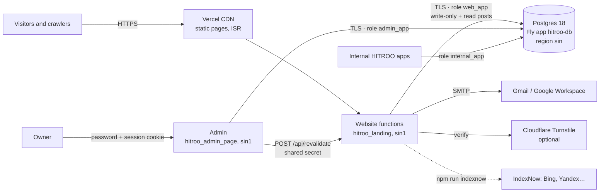

# HITROO — Architecture

How the HITROO website, the admin and the shared HITROO database fit together. Pairs with [KT.md](KT.md) (what we built), [CHANGELOG.md](CHANGELOG.md) (what changed, when) and [designs.md](designs.md) (how it looks).

The apps live side by side in `Hitroo_internal_Apps/hitroo/`:

| Folder | What | Stack |
| --- | --- | --- |
| `hitroo_landing` (this repo) | The public website, www.hitroo.com. Also home of the shared database's schema (`db/`). | Next.js 13, Vercel |
| `hitroo_admin_page` | The owner's admin: website analytics, leads, applications, posts. | Next.js 16, Vercel |
| later internal apps | Each gets its own folder, database role and schema. | — |

## System overview



| Piece | Where | Notes |
| --- | --- | --- |
| Website | Vercel project `hitroo-landing` (Next.js 13 App Router) | Live at www.hitroo.com (`hitroo.com` redirects there). `vercel.json` pins functions to `sin1` (Singapore), next to the database. Pushing to `main` deploys to production. |
| Admin | Vercel project `hitroo_admin`, live at admin.hitroo.com, Next.js 16 | One owner password; everything server-rendered; no public pages. See `../hitroo_admin_page/README.md`. |
| Database | Fly.io app `hitroo-db` | Fly Postgres (flex), PostgreSQL 18, 1 machine `shared-cpu-1x` / 1 GB, 10 GB encrypted volume, region `sin`. |
| Public DB endpoint | `hitroo-db.fly.dev:5432` | Dedicated IPv4 `149.248.221.16` ($2/month) with Fly's `pg_tls` handler; connect with `sslmode=verify-full`. Fly apps can use `hitroo-db.internal` over the private network. |
| Email | Gmail SMTP (`nodemailer`) | Lead and application notifications plus acknowledgments. |
| Spam protection | Honeypot + timing + optional Turnstile | Turnstile only when both keys are set. |

The Fly app replaced the earlier `decern-hitroo` server, which was destroyed on 2026-09-25 (its 892 KB data volume is backed up at `Hitroo_internal_Apps/_backups/decern-data-backup-2026-09-25.tgz`).

## Database layout

One database, `hitroo`, split into segments by schema. Each consumer gets its own login role, with only the rights it needs.

| Schema | Owner | Role | Access |
| --- | --- | --- | --- |
| `web` | `postgres` | `web_app` (the website) | **Write-only** for forms, analytics and consent (`INSERT`), plus `SELECT (id)` / `UPDATE (emailed)` on leads and applications to mark notifications sent; `SELECT` on `posts`. Cannot read anyone's details back. |
| `web` | `postgres` | `admin_app` (the admin) | `SELECT/INSERT/UPDATE/DELETE` on rows. No DDL, no `internal`. |
| `internal` | `internal_app` | `internal_app` (internal apps) | Owns the schema and manages its own tables. |
| `public` | — | — | `public.schema_migrations` only; `PUBLIC` has no access. |

`web` tables (see [db/migrations/](db/migrations/)):

| Table | Holds |
| --- | --- |
| `web.leads` | Project enquiries (name, email, phone, interest, message, page, country/region/city, user agent, `emailed`, `status`, `notes`). |
| `web.job_applications` | Careers applications, including the answers and the PDF resume (`bytea`, ≤ 3 MB), `status`, `notes`. |
| `web.page_views` | One row per page view: path, referrer host, UTM, country/region/city, device/browser/OS, language, `visit_id` and `view_id` (random, held only in the page's memory), `visitor_id`/`session_id` only with consent. No IP addresses. |
| `web.events` | Clicks (link or button text and target) and engagement (visible seconds since the last report, furthest scroll %) per view. |
| `web.consents` | Cookie decisions (`granted`/`denied`, policy version, country) as proof of consent. |
| `web.posts` | Articles and blog posts (kind, slug, title, excerpt, body, category, cover, status, dates, SEO fields, `legacy_id`). |

**Credentials** live outside the repos in `Hitroo_internal_Apps/_secrets/hitroo-db.env` (chmod 600): superuser URL, `hitroo` admin URL, `web_app`, `internal_app` and `admin_app` URLs. The website only ever gets `DATABASE_URL` = the `web_app` URL; the admin gets the `admin_app` URL. The admin's sign-in password, session secret and the shared revalidate key are in `_secrets/hitroo-admin.env`. Store these in a password manager too.

### Adding another internal app

```sql
-- as postgres, on database hitroo
CREATE ROLE app_example LOGIN PASSWORD '…' CONNECTION LIMIT 20;
GRANT CONNECT ON DATABASE hitroo TO app_example;
CREATE SCHEMA app_example AUTHORIZATION app_example;
```

Then give the app `postgres://app_example:…@hitroo-db.fly.dev:5432/hitroo?sslmode=verify-full` (or `hitroo-db.internal:5432` if it runs on Fly) and set its `search_path` to its schema. Keep apps in separate schemas and roles; share data through explicit views, not shared tables. Put the role script in `db/roles/` like [db/roles/admin_app.sql](db/roles/admin_app.sql).

## Data flows

1. **Enquiries** — home page and `/contact` → `POST /api/lead` → strict zod schema, same-origin check, honeypot, completion timing, optional Turnstile → `INSERT web.leads` → Gmail notification + acknowledgment → `emailed = true`. If email fails, the lead is already stored and the visitor still sees success.
2. **Careers** — `/careers` → `POST /api/careers` → validation and PDF check (≤ 3 MB: Vercel caps request bodies at 4.5 MB and the PDF travels base64-encoded) → `INSERT web.job_applications` (with the resume) → email with the resume attached.
3. **Analytics** — `components/corporate/Analytics` → `POST /api/track` (bot filter, 120 requests/min/IP, same-origin, strict schema in `lib/track-schema.ts`):
   - a **view** on every route change → `web.page_views`;
   - a **click** for links and buttons (label, and the target without query strings) → `web.events`;
   - **engagement** when the route changes, the tab is hidden or the page closes: visible seconds since the last report and the furthest scroll (of the article on post pages) → `web.events`.

   A random `visit_id` (one per page load, in memory only, so a reload starts a new visit) groups a visit's pages; `view_id` ties engagement to its view. Country, region and city come from Vercel's edge headers (`x-vercel-ip-*`); the IP itself is never stored. Visitor and session IDs are attached only when the `hitroo_consent` cookie is `granted`. A post counts as **read** at 75% of the article.
4. **Consent** — `CookieConsent` (bottom-left) sets `hitroo_consent` (1 year) and, on accept, `hitroo_vid` (random UUID, 1 year) → `POST /api/consent` → `INSERT web.consents`. "Cookie settings" in the footer reopens it. Policy text: `/privacy`.
5. **Posts** — admin → `web.posts` → the admin calls `POST /api/revalidate` on the website (header `x-revalidate-secret`, constant-time compare) → `revalidatePath` refreshes `/insights`, `/articles`, `/blog` and the post page at once (ISR every 5 minutes otherwise). The sitemap and `llms.txt` refresh every 10 minutes.
6. **Admin** — owner signs in with `ADMIN_PASSWORD` → HMAC-signed session cookie (`hitroo_admin`, httpOnly, 12 hours; 5 failed tries per 15 minutes) → the proxy sends anyone without a session to `/login`, and every page, Server Action and route handler checks the session again → reads and updates `web.*` as `admin_app`.

## SEO and GEO (answer engines)

- **Metadata per page** via `pageMetadata()` in [lib/seo.ts](lib/seo.ts): title (template `%s | HITROO`), description, canonical, `hreflang` en / x-default, Open Graph and Twitter. The root layout never sets a canonical (it would be inherited by every page). Every page renders the same set of meta tags (Next 13.5 reuses head tags by position during client navigation).
- **Structured data** (JSON-LD): `Organization` (with an `OfferCatalog` of services, contact points, `areaServed: Worldwide`) and `WebSite` on every page; `WebPage`/`AboutPage`/`ContactPage`/`CollectionPage` per page; `Service` per service; `Article`/`BlogPosting` per post; `FAQPage` on `/ai-perspective`; `BreadcrumbList` on interior pages.
- **Discovery**: `/sitemap.xml` (pages, services, posts), `/robots.txt` (every search and AI crawler allowed — GPTBot, OAI-SearchBot, ChatGPT-User, ClaudeBot, PerplexityBot, Google-Extended, Bingbot, Applebot and more — with `/api/` disallowed for all), `/llms.txt` and `/llms-full.txt` (live summaries for AI assistants), and IndexNow (`public/<key>.txt` + `npm run indexnow`), which pushes URLs to Bing — Bing's index also feeds ChatGPT search and Copilot.
- **Measuring it**: the admin's Channels report separates **AI assistants** (ChatGPT, Perplexity, Gemini, Claude, Copilot — by referrer or `utm_source`, e.g. ChatGPT's `utm_source=chatgpt.com`) from search, social, email, paid, campaigns and referrals.
- **Performance**: server components with small client islands (~91–107 kB first-load JS), `next/image` AVIF/WebP on Vercel, Inter via `next/font`, static pages on the CDN.
- **Verification**: `GOOGLE_SITE_VERIFICATION` and `BING_SITE_VERIFICATION` env vars render the meta tags.

## Security

- Postgres over TLS with full certificate verification. The website's role cannot read leads, applications or analytics, cannot change or delete rows (beyond marking emails sent), cannot create or alter tables, and cannot see the `internal` schema. The admin's role cannot change the schema or see `internal`.
- The admin is a separate app with no public pages; its responses carry `X-Frame-Options: DENY` and `X-Robots-Tag: noindex`.
- No IP addresses stored; identifiers only with consent; no third-party trackers.
- Same-origin checks, payload size limits, strict schemas and rate limits on every write endpoint.
- Security headers (`nosniff`, `Referrer-Policy: strict-origin-when-cross-origin`, `X-Frame-Options`, `Permissions-Policy`); `poweredByHeader` off. No referrer meta tag (the header sets the policy).
- Secrets only in env vars (Vercel) and `_secrets/` (local). `.env*.local` and `.env` are git-ignored.

## Operations

| Task | How |
| --- | --- |
| New migration | Add `db/migrations/NNN_name.sql` → `npm run db:migrate` (uses `DATABASE_ADMIN_URL`; each file once, in a transaction). Grant rights explicitly: new `web` tables are not readable by `web_app` by default, only by `admin_app`. |
| First-time setup | [db/bootstrap.sql](db/bootstrap.sql) (roles, database, schemas), then [db/roles/admin_app.sql](db/roles/admin_app.sql), each run once as `postgres`. |
| Import old CMS posts | `npm run db:seed-posts` (idempotent). |
| After a production deploy | `npm run indexnow`. |
| Database health | `fly status -a hitroo-db`, `fly checks list -a hitroo-db`. |
| Backups | Fly takes daily volume snapshots (`fly volumes snapshots list -a hitroo-db`, 5-day retention). Recommended: turn on continuous backups to Tigris (needs you to accept Tigris's terms) and/or a scheduled `pg_dump`. |
| Grow storage | `fly volumes extend <vol-id> -s <GB> -a hitroo-db`. |

### Vercel environment variables

**Website** (`hitroo-landing`): `DATABASE_URL` (web_app URL, Production only, so preview deployments never write to the live database), `GMAIL_USER`, `GMAIL_APP_PASSWORD`, `LEAD_EMAIL_RECIPIENT`, `REVALIDATE_SECRET` (same value as the admin's), optional `TURNSTILE_SITE_KEY` + `TURNSTILE_SECRET_KEY`, optional `GOOGLE_SITE_VERIFICATION`, `BING_SITE_VERIFICATION`, `GROQ_API_KEY`, and `NEXT_PUBLIC_SITE_URL` for preview deployments (default `https://www.hitroo.com`). `ADMIN_PASSWORD` was removed from the website on 2026-09-26. Never set `DATABASE_ADMIN_URL` on Vercel.

**Admin** (`hitroo_admin_page`): `DATABASE_URL` (admin_app URL), `ADMIN_PASSWORD`, `SESSION_SECRET` (32+ random characters), `SITE_URL` (`https://www.hitroo.com`), `REVALIDATE_SECRET`.

## Code map

| Path | What |
| --- | --- |
| `app/(site)/` | Marketing pages; `layout.tsx` adds Header, Footer, Analytics and CookieConsent. |
| `app/api/` | `lead`, `careers`, `track`, `consent`, `revalidate`, `chat`. |
| `app/sitemap.ts`, `app/robots.ts`, `app/llms.txt/`, `app/llms-full.txt/` | Discovery files. |
| `components/corporate/` | Design system and page blocks; `components/seo/JsonLd.tsx`. |
| `lib/db.ts`, `lib/data/*` | Postgres pool and write-only data access (forms, analytics) plus post reads. |
| `lib/track.ts`, `lib/track-schema.ts` | Click/scroll helpers for the browser; the `/api/track` payload schema. |
| `lib/seo.ts`, `lib/llms.ts` | Metadata and structured-data builders; llms.txt content. |
| `lib/visitor.ts`, `lib/rate-limit.ts`, `lib/request-security.ts`, `lib/lead-protection.ts` | Request helpers and protections. |
| `db/`, `scripts/` | Bootstrap SQL, roles, migrations, migration/seed/IndexNow scripts. |
| `../hitroo_admin_page` | The admin app (its own README). |
